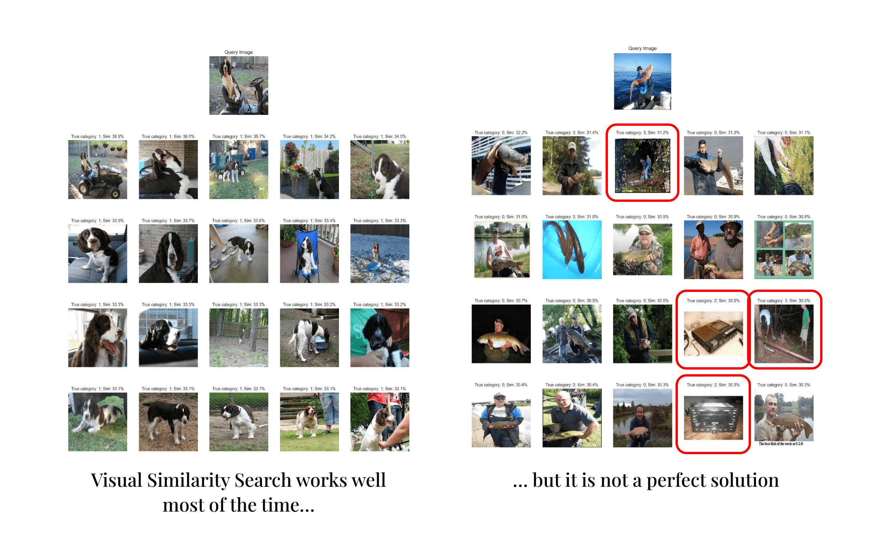
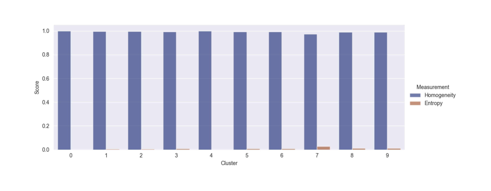
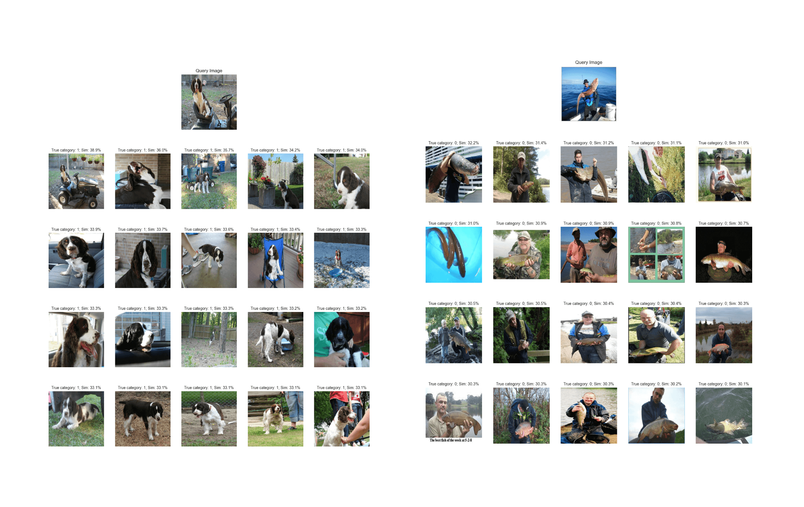

# ViTopic: Topic Modeling on Images with Clustering of Vision Transformer Embeddings

Image data is essential in various fields, but collecting and labeling it is time-consuming and challenging. The project aims to develop an automated system that can cluster and describe unlabeled images, allowing analysts to process visual data quickly and accurately. The primary objective is to create a tool that can help people cluster images and generate text-based topics for each cluster. This will improve image data processing efficiency, reduce labor costs, and facilitate the analysis of visual data.


## How It Works
Below are the general steps to generate context-guided visual topics:
1. Generate vision embeddings and image captions using pre-trained models.
2. Generate a pair-wise similarity matrix using the vision embeddings and some similarity function. This matrix can be used for visual similarity search.
3. Assign clusters to the vision embeddings using a clustering algorithm.
4. Use the cluster information and the image captions to generate a Class-based Term-Frequency Inverse-Document-Frequency (c-TF-IDF) matrix.
5. Extract frequent words in each cluster from the c-TF-IDF matrix.


## Results
The above pipeline works well for most of the images sampled for the project (visit the `./data-processing.colab.ipynb` for more information on the data processing). However, as seen below, the visual similarity search sometimes returns unrelated images with high confidence.



On the other hand, the context-guided topic model performed excellently. Not only did the model find 10 clusters (which matches with the number of true categories in the dataset), but also generated topic descriptors which match the true ImageNette classes. Additionally, as shown in the plots below, the cluster items have low collision entropy (high homogeneity) when computed using the true ImageNette classes.



### Using Cluster Information to Improve Visual Similarity Search
Since we have information about which cluster each image belongs to, we can use that information to decrease the similarity between images outside of their own clusters. Decreasing the out-of-cluster weights by only 10% drastically improved the performance of the visual similarity search.



## Installing & Running
```
Coming Soon...
```

---
Final Project for ITCS-5156 @ UNC Charlotte
