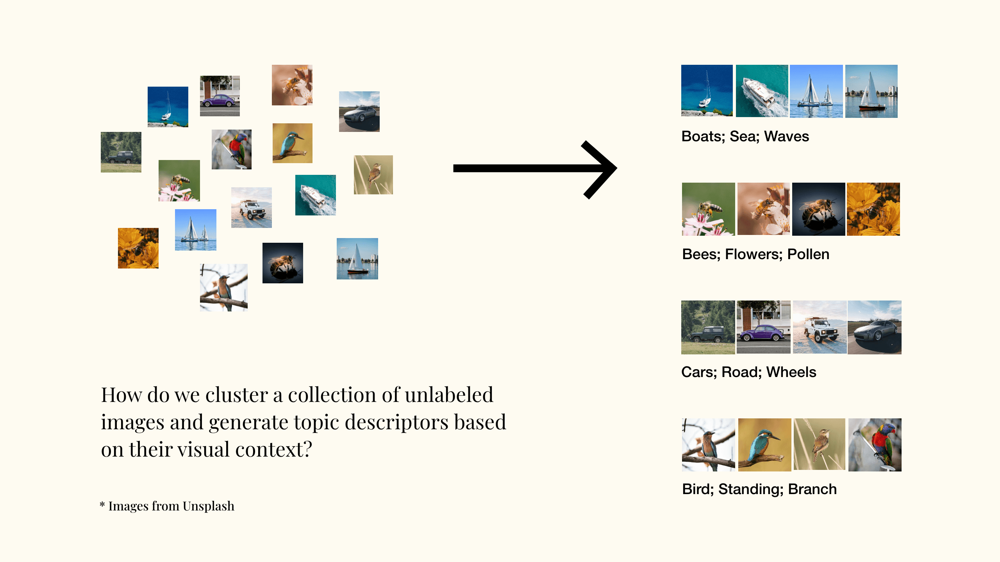
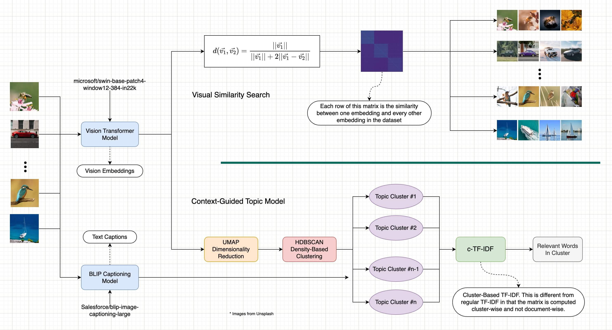

# ViTopic: Topic Modeling on Images with Clustering of Vision Transformer Embeddings

Image data is essential in various fields, but collecting and labeling it is time-consuming and challenging. The project aims to develop an automated system that can cluster and describe unlabeled images, allowing analysts to process visual data quickly and accurately. The primary objective is to create a tool that can help people cluster images and generate text-based topics for each cluster. This will improve image data processing efficiency, reduce labor costs, and facilitate the analysis of visual data.



## How to Use it
```
Coming Soon...
```

## How It Works
Below are the general steps to generate context-guided visual topics:
1. Generate vision embeddings and image captions using pre-trained models.
2. Generate a pair-wise similarity matrix using the vision embeddings and some similarity function. This matrix can be used for visual similarity search.
3. Assign clusters to the vision embeddings using a clustering algorithm.
4. Use the cluster information and the image captions to generate a Class-based Term-Frequency Inverse-Document-Frequency (c-TF-IDF) matrix.
5. Extract frequent words in each cluster from the c-TF-IDF matrix.



For more information on how the methods, results, and evaluations, read the project's report in the "./docs/ViTopic – Report.pdf" file.

---
Final Project for ITCS-5156 @ UNC Charlotte
